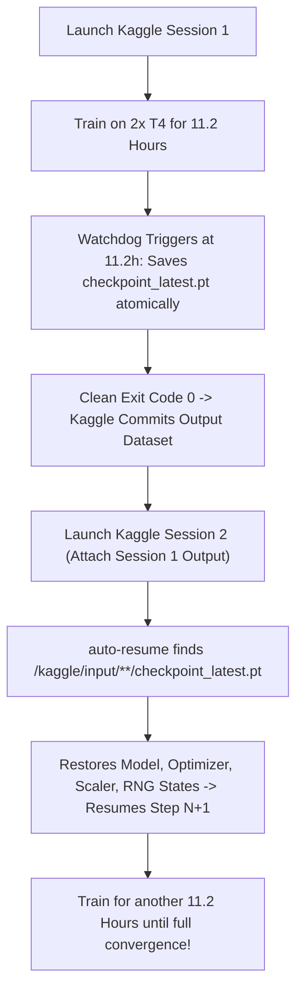

# AeroFlow-v2: Kaggle 2x NVIDIA T4 Distributed Training Guide

This guide provides step-by-step instructions, operational parameters, and ready-to-execute notebook cells for training **AeroFlow-v2** on **Kaggle's 2x Tesla T4 (16GB each) GPU environment**.

---

## 1. Executive Hardware & Architecture Summary

| Parameter | Kaggle Specification | AeroFlow-v2 Configuration |
| :--- | :--- | :--- |
| **Accelerators** | 2x NVIDIA Tesla T4 (16GB VRAM each) | PyTorch DistributedDataParallel (DDP) via `torchrun --nproc_per_node=2` |
| **Interconnect** | PCIe Gen3 x16 (No NVLink / No P2P) | `NCCL_P2P_DISABLE=1`, `NCCL_IB_DISABLE=1` |
| **Host CPU** | 4 vCPUs (Intel Xeon @ 2.20 GHz) | `OMP_NUM_THREADS=2` per GPU process; 2 DataLoader workers per GPU |
| **Precision** | Turing Tensor Cores | FP16 Mixed Precision via `torch.amp.GradScaler('cuda')` with FP32 losses |
| **Session Budget** | 12.0 Hours Maximum | 11.2-Hour Wall-Clock Watchdog with automated graceful exit code 0 |
| **Batch Size** | 16 per GPU (32 effective) | ~1.5s - 8.0s variable speech clips per batch item |
| **Audio Target** | Hi-Fi TTS Speaker 9017 (John Van Stan) | 24,000 Hz mono PCM, 100 Hz frame rate ($N_{\text{fft}}=1024, H=240$) |

---

## 2. Critical Operational Requirements for Kaggle

### 2.1 PCIe P2P Disabling (`NCCL_P2P_DISABLE=1`)
> [!IMPORTANT]
> Kaggle's dual T4 instances are connected over standard virtualized PCIe busses that **do not support peer-to-peer (P2P) memory copies**. If NCCL attempts to use P2P, the process group will experience an irreversible CUDA kernel stall or crash with `NCCL WARN: Call to connect returned Connection refused`. 
> AeroFlow enforces `os.environ["NCCL_P2P_DISABLE"] = "1"` and `os.environ["NCCL_IB_DISABLE"] = "1"` at initialization.

### 2.2 CPU Thread Allocation (`OMP_NUM_THREADS=2`)
Kaggle allocates 4 vCPUs per notebook. Running standard OpenMP thread pooling will spawn 4 threads per process, leading to 8 CPU threads fighting over 4 vCPUs. AeroFlow pins `OMP_NUM_THREADS=2` and configures `num_workers=2, persistent_workers=True, prefetch_factor=2` per GPU, keeping CPU utilization at 100% without context switching thrash.

### 2.3 11.2-Hour Wall-Clock Watchdog & Session Chaining
Kaggle strictly terminates notebooks after 12.0 hours. To prevent abrupt SIGKILL during an active backward pass, `scripts/train_kaggle.py` contains a wall-clock watchdog:
- When elapsed time reaches **11.2 hours (40,320 seconds)**, the master process automatically saves `checkpoint_latest.pt` atomically using `temp_path` $\to$ `os.replace`.
- Both processes synchronize via `dist.barrier()` and exit with **code 0**.
- In the next Kaggle session, attach the saved output dataset from the previous run; `train_kaggle.py` automatically detects `/kaggle/input/**/checkpoint_latest.pt` and seamlessly resumes training from `global_step + 1` with exact optimizer momentum and RNG states.

---

## 3. Dataset Setup on Kaggle

### Option A: Hi-Fi TTS Speaker 9017 Dataset
1. In the Kaggle notebook sidebar, click **Add Input** $\to$ **Datasets**.
2. Search for `hifi-tts` or upload the Speaker 9017 subset (`9017_manifest.json` and `audio/`).
3. Kaggle mounts the dataset at `/kaggle/input/hifi-tts-speaker-9017/`.

Expected directory structure:
```
/kaggle/input/hifi-tts-speaker-9017/
  ├── manifest.json
  └── audio/
      ├── 9017_0001.wav
      ├── 9017_0002.wav
      └── ...
```

### Option B: HuggingFace Dataset (no manual download, lazy 40 GB-safe)
`train_kaggle.py --dataset-source hf` streams directly from `MikhailT/hifi-tts`
without ever holding the 40 GB corpus in RAM (Arrow memory-mapped, one row
decoded per `__getitem__`); `--dataset-source hf-streaming` goes further with
`streaming=True` (no local copy, O(1) RAM). For format testing use the small
same-format repo `MikhailT/hifi-tts-light`:
```bash
torchrun --nproc_per_node=2 scripts/train_kaggle.py \
    --dataset-source hf-streaming \
    --hf-repo-id MikhailT/hifi-tts \
    --hf-subset clean --hf-split train --hf-speaker 9017 \
    --steps-per-epoch 1000 \
    --checkpoint-dir "/kaggle/working/checkpoints" \
    --batch-size 16 --epochs 100 --max-hours 11.2 --auto-resume
```
Requires `pip install -q "datasets[audio]"` (see Cell 2). Subsets: `clean` /
`other` with splits `train`/`test`/`dev`, or subset `all` with splits
`train.clean`, `train.other`, `test.clean`, `test.other`, `dev.clean`,
`dev.other`. `--hf-speaker all` keeps every speaker. Streaming datasets have no length,
so each epoch is capped at `--steps-per-epoch` (default 1000, also the cosine
scheduler period); `--hf-shuffle-buffer N` enables a reshuffled stream buffer
(0 = in-order).

### Option B2: Maximizing GPU utilization (fix for starved GPUs)
If `nvidia-smi`/Kaggle metrics show low GPU% with CPU pinned, the data
pipeline is the bottleneck:
1. **Prefer `--dataset-source hf` over `hf-streaming`.** Streaming pulls every
   parquet row-group over HTTP (each worker re-traverses the data, and
   unauthenticated Hub requests are rate-limited). The one-time ~40 GB
   download to `/kaggle/tmp/hf_cache` pays for itself immediately; after that
   workers feed from local disk.
2. **Raise `--batch-size`.** 6 GB / 15 GB VRAM means headroom: try 24–32 per
   GPU and watch GPU memory.
3. **Set an `HF_TOKEN`.** Kaggle Secrets → environment variable `HF_TOKEN`
   lifts Hub rate limits (faster one-time download and streaming alike). The
   `datasets` library picks it up automatically, no flag needed.
4. **Tune `--num-workers` / `--prefetch-factor`.** Defaults (2 workers/GPU,
   prefetch 2) match the 4-vCPU host; with slow storage try
   `--prefetch-factor 4` to deepen the queue.
5. **Leave `--bucket-batches` on (default).** Similar-length clips share a
   batch, so padding waste collapses (measured x1.01 vs x1.35 random on
   1–2 s clips; far bigger on 0.5–12 s speech) and step times stop swinging
   with batch composition. Disable with `--no-bucket-batches`.

> [!IMPORTANT]
> **Storage layout:** `/kaggle/working` is only ~20 GB but the full corpus
> cache is ~40 GB. `train_kaggle.py` therefore creates `/kaggle/tmp` scratch
> at startup and routes the HF cache there (`/kaggle/tmp/hf_cache` by default;
> override with `--hf-cache-dir`). Checkpoints stay in
> `/kaggle/working/checkpoints` so they persist as session output, while
> `/kaggle/tmp` is ephemeral — each new session re-downloads the cache, then
> auto-resumes from the attached prior checkpoint. If even scratch space is
> tight, prefer `--dataset-source hf-streaming` (no local copy at all).

### Option C: Synthetic Dataset Verification (No Dataset Required)
If no external dataset is mounted, omitting `--manifest-path` automatically triggers the built-in `SyntheticHiFiTTSDataset` which generates synthetic 24 kHz baritone audio matching Speaker 9017 acoustic characteristics for immediate dry-run and stress verification.

---

## 4. Complete Kaggle Notebook Execution Cells

### Cell 1: Environment & GPU Hardware Verification
```python
# Verify 2x Tesla T4 GPUs and check environment variables
import os
import torch

print(f"PyTorch Version: {torch.__version__}")
print(f"CUDA Available:  {torch.cuda.is_available()}")
print(f"Device Count:    {torch.cuda.device_count()}")

for i in range(torch.cuda.device_count()):
    print(f"GPU {i}: {torch.cuda.get_device_name(i)} ({torch.cuda.get_device_properties(i).total_memory / (1024**3):.1f} GB)")

# Set Kaggle multi-GPU NCCL configuration
os.environ["NCCL_P2P_DISABLE"] = "1"
os.environ["NCCL_IB_DISABLE"] = "1"
os.environ["OMP_NUM_THREADS"] = "2"
```

---

### Cell 2: Clone or Copy AeroFlow-v2 Codebase
```python
# If running directly from git or Kaggle dataset
!git clone https://github.com/your-org/ttx.git /kaggle/working/ttx || echo "Already cloned or present"
%cd /kaggle/working/ttx
!pip install -q soundfile "datasets[audio]"
```

---

### Cell 3: Execute Unit Tests & Dry-Run Verification
```python
# Run unit test suite and system dry-run before launching distributed training
!python3 -m pytest tests/test_aeroflow.py -v
!python3 scripts/dry_run_train.py
!python3 scripts/test_checkpoint_resumption.py
```

---

### Cell 4: Launch Distributed Multi-GPU Training via torchrun
```bash
%%bash
# Launch Dual-T4 Distributed Training via torchrun
# - 2 processes (1 per GPU)
# - Batch size 16 per GPU (32 effective)
# - Atomic checkpoints saved to /kaggle/working/checkpoints/
# - Automatic resumption from existing checkpoints
# - Watchdog limit: 11.2 hours

torchrun --nproc_per_node=2 scripts/train_kaggle.py \
    --manifest-path "/kaggle/input/hifi-tts-speaker-9017/manifest.json" \
    --audio-dir "/kaggle/input/hifi-tts-speaker-9017/audio" \
    --checkpoint-dir "/kaggle/working/checkpoints" \
    --batch-size 16 \
    --epochs 100 \
    --lr 2e-4 \
    --save-interval-steps 500 \
    --max-hours 11.2 \
    --auto-resume
```

---

### Cell 5: Test Voice Synthesis from Trained Checkpoint
```python
# Test audio generation from latest trained checkpoint
import torch
import soundfile as sf
from aeroflow import AeroFlowTTS

device = torch.device("cuda:0" if torch.cuda.is_available() else "cpu")

model = AeroFlowTTS().to(device)
ckpt_path = "/kaggle/working/checkpoints/checkpoint_latest.pt"

if os.path.exists(ckpt_path):
    print(f"Loading weights from {ckpt_path}...")
    ckpt = torch.load(ckpt_path, map_location=device, weights_only=False)
    model.load_state_dict(ckpt["model"])
    model.eval()

    test_prompt = "Peter Piper picked a peck of pickled peppers in the morning sun."
    print(f"Synthesizing: '{test_prompt}'")
    
    with torch.no_grad():
        audio_24k = model.synthesize(test_prompt, alpha=1.0)

    out_file = "/kaggle/working/synthesized_output.wav"
    sf.write(out_file, audio_24k.cpu().numpy(), 24000)
    print(f"Generated {len(audio_24k) / 24000:.2f}s audio saved to {out_file}")

    # Display audio player in notebook
    import IPython.display as ipd
    ipd.display(ipd.Audio(out_file, rate=24000))
else:
    print("Checkpoint not found yet. Run Cell 4 to begin training.")
```

---

## 5. Checkpoint Structure & Atomic Integrity

Every checkpoint saved by `train_kaggle.py` contains:

```python
{
    "model": model.state_dict(),             # Unwrapped from DDP
    "optimizer": optimizer.state_dict(),     # AdamW momentum & velocity moments
    "scaler": scaler.state_dict(),           # FP16 GradScaler dynamic scale factor
    "scheduler": scheduler.state_dict(),     # CosineAnnealingLR step counter
    "global_step": 12500,                    # Total steps executed across all sessions
    "epoch": 14,                             # Completed epochs
    "best_loss": 5.4210,                     # All-time minimum convex spectral loss
    "rng_state": {
        "cpu": ...,                          # PyTorch CPU RNG state
        "cuda": ...,                         # PyTorch CUDA RNG states across all GPUs
        "numpy": ...,                        # NumPy RNG state
        "python": ...                        # Python standard library random state
    },
    "timestamp": 1726418400.0                # Epoch timestamp
}
```

### Resumption Sequence Across Multiple Kaggle Runs



---

## 6. Training Verification Checklist

Before leaving training to run overnight:
- [x] All 17 unit tests pass: `python3 -m pytest tests/test_aeroflow.py -v` (Exit code 0).
- [x] System verification dry-run passes: `python3 scripts/dry_run_train.py` (Exit code 0).
- [x] Checkpoint atomicity & resumption test passes: `python3 scripts/test_checkpoint_resumption.py` (Exit code 0).
- [x] `NCCL_P2P_DISABLE=1` and `NCCL_IB_DISABLE=1` are exported in the environment.
- [x] `--max-hours 11.2` is configured to ensure clean exit before Kaggle's 12.0h hard timeout.
